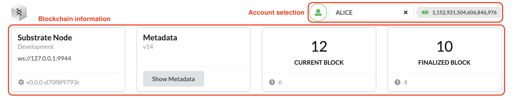
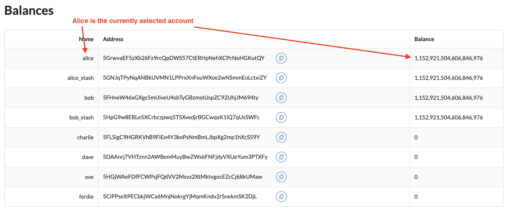
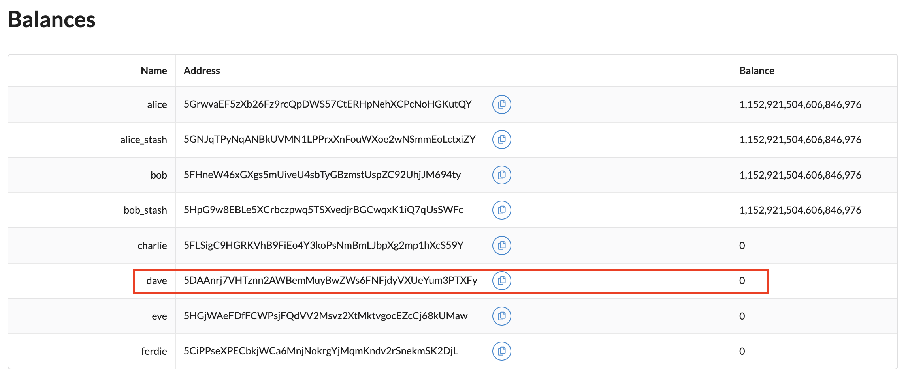
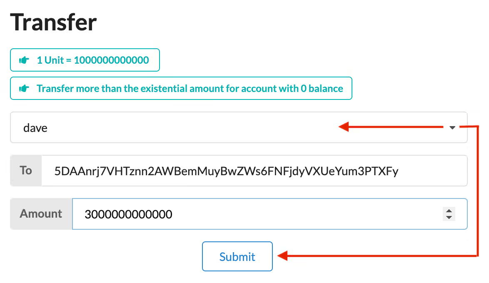
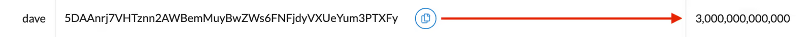
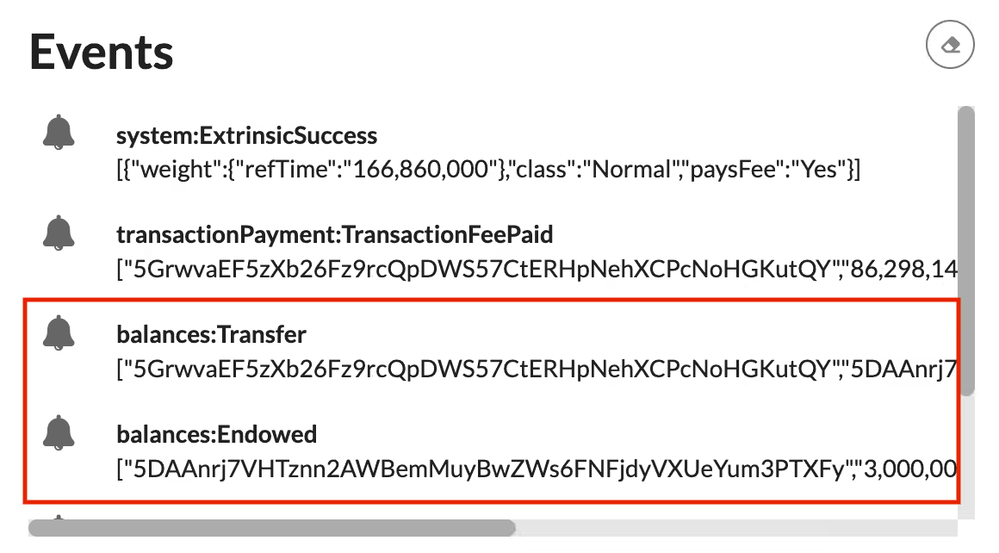
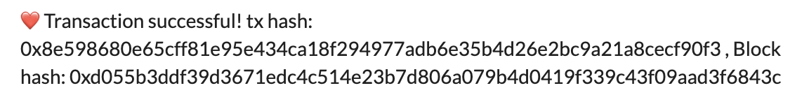
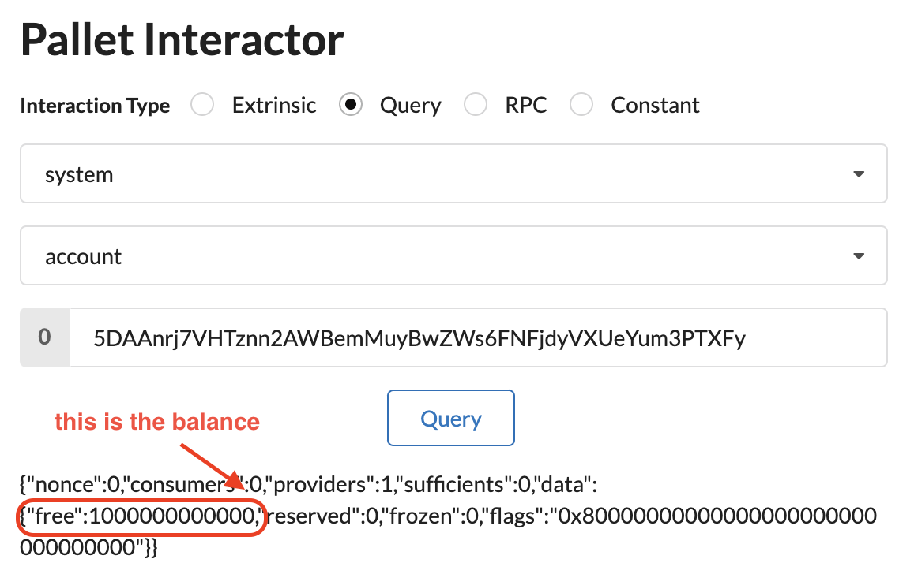

# Build a local blockchain

After learning the basics of the Polkadot SDK in [this video](https://youtu.be/_l5BwbbaIEE?si=xNBYhPt1KH14RFKr), the next step is to learn how to compile and launch a single local blockchain node.

## What will you learn?

In this tutorial you'll build and start a single node blockchain using the node template.

The node template provides a working single-node blockchain that you can run locally in your development environment. It includes several predefined components — such as user accounts and account balances — so that you can experiment with performing common tasks. Without making any changes to the template, you can run a functional node that produces blocks and allows transactions.

## How much time it will take?

If you're starting your journey as a blockchain developer, it can take approximately one to two hours.

## Tutorial goals

By completing this tutorial, you will accomplish the following objectives:

- Compile the node template and start a local Substrate-based blockchain.
- Install a front-end template to interact with the local blockchain node.
- Use the front-end template to submit a transaction and view the result.

## Dependencies

In order to complete this tutorial you need to install the following dependencies:

- [Rust](https://www.rust-lang.org/)
- [Node.js](https://nodejs.org/en)
- [Yarn](https://yarnpkg.com/)

To be sure that you have installed all the dependencies correctly, you should be able to run the following commands in your terminal:

```bash
rustc --version
# rustc 1.79.0 (129f3b996 2024-06-10)

node --version
# v22.0.0

yarn version
# yarn version v1.22.22
```

## Compile a Polkadot SDK node

The [Substrate node template](https://github.com/substrate-developer-hub/substrate-node-template) provides a working development environment so that you can start building on Polkadot SDK right away.

1. Open a new terminal shell on your computer.
2. Clone the node template repository by running the following command:

    ```bash
    git clone https://github.com/substrate-developer-hub/substrate-node-template
    ```

3. Change to the root of the node template directory by running the following command:

    ```bash
    cd substrate-node-template
    ```

    Create a new branch to contain your work:

    ```bash
    git switch -c my-first-blockchain
    ```

4. Compile the node template by running the following command:

    ```bash
    cargo build --release
    ```

The last operation takes approximately 10 minutes to complete, so you can drink a coffe in the meanwhile.

## Start the local node

Now that the compilation is complete, you can start the node:

1. Run the following command:

    ```bash
    ./target/release/node-template --dev
    ```

    The `--dev` option specifies that the node runs in development mode using predefined development chain specification. By default, this option also deletes all active data — such as keys, the blockchain database, and networking information - when you stop the node by pressing Control-c. Using the `--dev` option ensures that you have a clean working state any time you stop and restart the node.

2. Verify your node is up and running successfully by reviewing the output displayed in the terminal.

    The terminal should display output similar to this:

    ```bash
    2024-06-19 11:40:09 Substrate Node
    2024-06-19 11:40:09 ✌️  version 0.0.0-d70f8f9793c
    2024-06-19 11:40:09 ❤️  by Substrate DevHub <https://github.com/substrate-developer-hub>, 2017-2024
    2024-06-19 11:40:09 📋 Chain specification: Development
    2024-06-19 11:40:09 🏷  Node name: descriptive-lake-0056
    2024-06-19 11:40:09 👤 Role: AUTHORITY
    2024-06-19 11:40:09 💾 Database: RocksDb at /var/folders/k6/sgfrck7128j9s4l_25v61gn40000gn/T/substrateTD0U2D/chains/dev/db/full
    2024-06-19 11:40:10 🔨 Initializing Genesis block/state (state: 0x99e2…8ac5, header-hash: 0xab39…15f6)
    2024-06-19 11:40:10 👴 Loading GRANDPA authority set from genesis on what appears to be first startup.
    2024-06-19 11:40:10 Using default protocol ID "sup" because none is configured in the chain specs
    2024-06-19 11:40:10 🏷  Local node identity is: 12D3KooWSh5qN2STLgf2iRuNvhuxeMQpTdSBBHzSTV6yNnHtg9yd
    2024-06-19 11:40:10 💻 Operating system: macos
    2024-06-19 11:40:10 💻 CPU architecture: aarch64
    2024-06-19 11:40:10 📦 Highest known block at #0
    2024-06-19 11:40:10 Running JSON-RPC server: addr=127.0.0.1:9944, allowed origins=["*"]
    2024-06-19 11:40:10 〽️ Prometheus exporter started at 127.0.0.1:9615
    2024-06-19 11:40:12 🙌 Starting consensus session on top of parent 0xab39b0e06ada2cfa4577633858e32dbaf35aa75108f23020b6ee93274f7215f6
    2024-06-19 11:40:12 🎁 Prepared block for proposing at 1 (1 ms) [hash: 0x5bcf944fba253579ca611e7594784628abd826cf46746449b8e3e0a86005315a; parent_hash: 0xab39…15f6; extrinsics (1): [0x7a49…03fa]
    2024-06-19 11:40:12 🔖 Pre-sealed block for proposal at 1. Hash now 0x967ca4d17bedf0db57c22e8ded64606b05127af0d14088cafcd51cc043e1ff00, previously 0x5bcf944fba253579ca611e7594784628abd826cf46746449b8e3e0a86005315a.
    ...
    ```


    If the number after finalized is increasing, your blockchain is producing new blocks and reaching consensus about the state they describe.

3. Keep the terminal that displays the node output open to continue. If you force close it, the node will shut down.

## Install the front-end template

Right now the node is running fine and the blockchain is being created block by block.

Now you'll install a front-end template to interact with the node - and with the blockchain itself - by submitting a transaction and view the result.

The front-end template uses [React](https://react.dev/) to render a web browser interface that enables you to interact with the Polkadot SDK-based blockchain node. You can use this front-end template as a starting point for creating user interfaces for your own projects in future.

1. Open a new terminal window on your computer

2. Clone the front-end template repository by running the following command: 

    ```bash
    git clone https://github.com/substrate-developer-hub/substrate-front-end-template
    ```

3. Change to the root of the front-end template directory by running the following command:

    ```bash
    cd substrate-front-end-template
    ```

4. Install the dependencies for the front-end template by running the following command:

    ```bash
    yarn install
    ```

## Start the front-end template

The front-end template consists of user interface components to enable you to interact with the Substrate node and perform a few common tasks.

To use the front-end template:

1. Verify that your current working directory is the root directory where you installed the front-end template in the previous section.

2. Start the front-end template by running the following command:

    ```bash
    yarn start
    ```

Typically, running the yarn start command opens <http://localhost:8000> in your default browser automatically. If necessary, you can manually specify the <http://localhost:8000> URL to view the front-end template.

### Understanding the front-end template

The top section has an Account selection list for selecting the account to work with when you want to perform on-chain operations. The top section of the template also displays information about the chain to which you're connected.



You might also notice that the front-end template displays a Balances table with some predefined accounts and that a few of those accounts are preconfigured with funds. You can use this sample data to try out operations like transferring funds.



### Transfer funds from an account

Now that you have a blockchain node running on your local computer and you have a front-end template available for performing on-chain operations, you are ready to explore different ways to interact with the blockchain.

By default, the front-end template includes several components that allow you to try different common tasks. For this tutorial, you can perform a simple transfer operation that moves funds from one account to another.

To transfer funds to an account:

1. In the `Balances` table, notice the predefined accounts — such as dave — that have no funds associated with them.

    

    Under the `Balances` table, the front-end template also displays a `Transfer` component. You use this component to transfer funds from one account to another.

2. Select `dave` from the list of available accounts to populate the address to which you are transferring funds.

3. Specify at least `1000000000000` as the amount to transfer, then click `Submit`.

    

4. Notice that the values in `Balances` table is updated with the transfer.

    

5. Check the `Events` component to see events related to the transfer you just completed.

    The Polkadot SDK blockchain reports the result of asynchronous operations - such as a token transfer - as events, so you can use the `Events` components to see details about each operation performed as part of the transfer. For example:

    

6. When the transaction has been completed and included in a block, you see a confirmation message similar to the following:

    

### RPC Queries

The front-end template also gives you the possibility to run custom RPC queries to your local node, such as:

- get an account balance
- get all the information about a specific block
- get system information
- and so on ...

Indeed under the `Pallet Interactor` section you can submit whatever RPC call you like. In this tutorial you'll see how to get an account balance:

1. In the `Interaction Type` select `Query`

2. Then from the first menu select `system` and `account` from the second.

3. Paste the address you're interested in knowing the balance of and press `Query`.

You will see something like this:



## Stop the node

After a successful transfer, you can continue to explore the front-end template components or stop the local Polkadot SDK node to erase any state changes you have made.

Because you specified the `--dev` option when you started the node, stopping the local node stops the blockchain and purges all persistent block data so that you can start with a clean state next time you start the node.

To stop the local Substrate node:

1. Return to the terminal shell where the node output is displayed.

2. Press `Control-c` to terminate the running process.

## The end

Congratulations!

In this tutorial, you learned:

- How to start a working Polkadot SDK-based blockchain node using the node template.
- How to view and interact with the blockchain node using a front-end user interface.
- How to make a simple transfer from one account to another.

In the next tutorial you'll learn how you can customize the runtime using pallets, including how to add simple and complex pallets to the runtime.

See you there!
