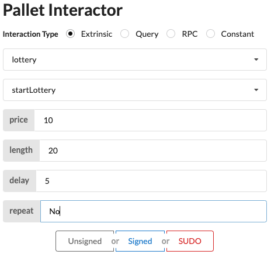
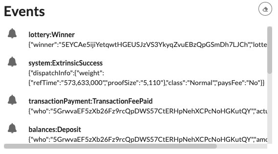

# Add a pallet to the runtime

After building a local blockchain in the previous tutoria, the next step is to learn how to add a custom pallet to the runtime, in order to add new functionalities to your blockchain.

## What will you learn?

- Add and configure new pallets to your blockchain runtime.

- Implement the `Config` trait for a pallet.

- Use the Lottery pallet to create and manage a lottery on your blockchain.

## How much time it will take?

If you're starting your journey as a blockchain developer, it can take approximately one to two hours.

## Add the Lottery pallet dependencies

Before you can use a new pallet, you must add some information about it to the configuration file that the compiler uses to build the runtime binary.

For Rust programs, you use the Cargo.toml file to define the configuration settings and dependencies that determine what gets compiled in the resulting binary. Because the Substrate runtime compiles to both a native platform binary that includes standard library Rust functions and a WebAssembly (Wasm) binary that does not include the standard Rust library, the Cargo.toml file controls two important pieces of information:

- The pallets to be imported as dependencies for the runtime, including the location and version of the pallets to import.

- The features in each pallet that should be enabled when compiling the native Rust binary. By enabling the standard (std) feature set from each pallet, you can compile the runtime to include functions, types, and primitives that would otherwise be missing when you build the WebAssembly binary.

To add the dependencies for the Latter pallet to the runtime:

1. Open a terminal shell and change to the root directory for the node template.

2. Open the `runtime/Cargo.toml` configuration file in a text editor.

3. Locate the `[dependencies]` section and note how other pallets are imported.

4. Add the follwing dependency:

    ```rust
    pallet-lottery = { git = "https://github.com/paritytech/polkadot-sdk.git", tag = "polkadot-v1.9.0", default-features = false }
    pallet-insecure-randomness-collective-flip = { git = "https://github.com/paritytech/polkadot-sdk.git", tag = "polkadot-v1.9.0", default-features = false }
    ```

5. Add the `pallet-lottery/std` and `pallet-insecure-randomness-collective-flip/std` features to the list of `features` to enable when compiling the runtime.

    ```rust
    [features]
    default = ["std"]
    std = [
    ...
    "pallet-aura/std",
    "pallet-balances/std",
    "pallet-lottery/std",
    "pallet-insecure-randomness-collective-flip/std",
    ...
    ]
    ```

    This section specifies the default feature set to compile for this runtime is the std features set. When the runtime is compiled using the std feature set, the std features from all of the pallets listed as dependencies are enabled. For more detailed information about how the runtime is compiled as a platform-native binary with the standard Rust library and as a WebAssembly binary using the no_std attribute, see Build process.

    If you forget to update the features section in the Cargo.toml file, you might see cannot find function errors when you compile the runtime binary.

6. Check that the new dependencies resolve correctly by running the following command:

    ```rust
    cargo check -p node-template-runtime --release
    ```

## The `Config` trait

Every pallet has a Rust trait called Config. The Config trait is used to identify the parameters and types that the pallet needs to carry out its functions.

Most of the pallet-specific code required to add a pallet is implemented using the Config trait. You can review what you to need to implement for any pallet by referring to its Rust documentation or the source code for the pallet.

You can have a look at the `Balance`'s `Config` trait:

```rust
pub trait Config<I: 'static = ()>: frame_system::Config {
/// The overarching event type.
#[pallet::no_default_bounds]
type RuntimeEvent: From<Event<Self, I>>
    + IsType<<Self as frame_system::Config>::RuntimeEvent>;

/// The overarching hold reason.
#[pallet::no_default_bounds]
type RuntimeHoldReason: Parameter + Member + MaxEncodedLen + Copy + VariantCount;

/// The overarching freeze reason.
#[pallet::no_default_bounds]
type RuntimeFreezeReason: VariantCount;

/// Weight information for extrinsics in this pallet.
type WeightInfo: WeightInfo;

/// The balance of an account.
type Balance: Parameter
    + Member
    + AtLeast32BitUnsigned
    + Codec
    + Default
    + Copy
    + MaybeSerializeDeserialize
    + Debug
    + MaxEncodedLen
    + TypeInfo
    + FixedPointOperand;

/// Handler for the unbalanced reduction when removing a dust account.
#[pallet::no_default_bounds]
type DustRemoval: OnUnbalanced<CreditOf<Self, I>>;

/// The minimum amount required to keep an account open. MUST BE GREATER THAN ZERO!
///
/// If you *really* need it to be zero, you can enable the feature `insecure_zero_ed` for
/// this pallet. However, you do so at your own risk: this will open up a major DoS vector.
/// In case you have multiple sources of provider references, you may also get unexpected
/// behaviour if you set this to zero.
///
/// Bottom line: Do yourself a favour and make it at least one!
#[pallet::constant]
#[pallet::no_default_bounds]
type ExistentialDeposit: Get<Self::Balance>;

/// The means of storing the balances of an account.
#[pallet::no_default]
type AccountStore: StoredMap<Self::AccountId, AccountData<Self::Balance>>;

/// The ID type for reserves.
///
/// Use of reserves is deprecated in favour of holds. See `https://github.com/paritytech/substrate/pull/12951/`
type ReserveIdentifier: Parameter + Member + MaxEncodedLen + Ord + Copy;

/// The ID type for freezes.
type FreezeIdentifier: Parameter + Member + MaxEncodedLen + Copy;

/// The maximum number of locks that should exist on an account.
/// Not strictly enforced, but used for weight estimation.
#[pallet::constant]
type MaxLocks: Get<u32>;

/// The maximum number of named reserves that can exist on an account.
#[pallet::constant]
type MaxReserves: Get<u32>;

/// The maximum number of individual freeze locks that can exist on an account at any time.
#[pallet::constant]
type MaxFreezes: Get<u32>;
}
```

After you identify the types your pallet requires, you need to add code to the runtime to implement the `Config` trait. To see how to implement the `Config` trait for a pallet, let's use the `Balances` pallet again as an example.

To review the `Config` trait for the `Balances` pallet:

1. Open the `runtime/src/lib.rs` file in a text editor (VSCode).

2. Locate the `Balances` pallet and note that it consists of the following implementation `impl` code block:

    ```rust
    pub type Balance = u128;

    // ...

    /// Existential deposit.
    pub const EXISTENTIAL_DEPOSIT: u128 = 500;

    impl pallet_balances::Config for Runtime {
    type MaxLocks = ConstU32<50>;
    type MaxReserves = ();
    type ReserveIdentifier = [u8; 8];
    /// The type for recording an account's balance.
    type Balance = Balance;
    /// The ubiquitous event type.
    type RuntimeEvent = RuntimeEvent;
    /// The empty value, (), is used to specify a no-op callback function.
    type DustRemoval = ();
    /// Set the minimum balanced required for an account to exist on-chain
    type ExistentialDeposit = ConstU128<EXISTENTIAL_DEPOSIT>;
    /// The FRAME runtime system is used to track the accounts that hold balances.
    type AccountStore = System;
    /// Weight information is supplied to the Balances pallet by the node template runtime.
    type WeightInfo = pallet_balances::weights::SubstrateWeight<Runtime>;
    }
    ```

    As you can see in this example, the impl `pallet_balances::Config` block allows you to configure the types and parameters that are specified by the Balances pallet Config trait. For example, this impl block configures the Balances pallet to use the `u128` type to track balances.
    
## Implement the configuration for Lottery

Now that you have seen an example of how the `Config` trait is implemented for the `Balances` pallet, you're ready to implement the `Config` trait for the `Lottery` pallet.

To implement the `Lottery` pallet in your runtime:

1. Open the `runtime/src/lib.rs` file in a text editor (VSCode).

2. Locate the last line of the `Balances` code block.

3. Add the following code block for the `Lottery` pallet:

    ```rust
    impl pallet_insecure_randomness_collective_flip::Config for Runtime {}

    parameter_types! {
        pub const LotteryPalletId: PalletId = PalletId(*b"py/lotto");
        pub const MaxCalls: u32 = 10;
        pub const MaxGenerateRandom: u32 = 10;
    }
    
    impl pallet_lottery::Config for Runtime {
        type PalletId = LotteryPalletId;
        type RuntimeCall = RuntimeCall;
        type Currency = Balances;
        type Randomness = RandomnessCollectiveFlip;
        type RuntimeEvent = RuntimeEvent;
        type ManagerOrigin = EnsureRoot<AccountId>;
        type MaxCalls = MaxCalls;
        type ValidateCall = Lottery;
        type MaxGenerateRandom = MaxGenerateRandom;
        type WeightInfo = pallet_lottery::weights::SubstrateWeight<Runtime>;
    }
    ```

4. Add `Lottery` to the runtime.

    ```rust
    // Create the runtime by composing the FRAME pallets that were previously configured.
    #[frame_support::runtime]
    mod runtime {

        // ...

        // Include the custom logic from the pallet-template in the runtime.
        #[runtime::pallet_index(7)]
        pub type TemplateModule = pallet_template;

        // Add the following 2 pallets to the runtime
        #[runtime::pallet_index(8)]
        pub type Lottery = pallet_lottery;

        #[runtime::pallet_index(9)]
        pub type RandomnessCollectiveFlip = pallet_insecure_randomness_collective_flip;
    }
    ```

5. Save your changes and close the file.

6. Check that the new dependencies resolve correctly by running the following command:

    ```rust
    cargo check -p node-template-runtime --release
    ```

    If there are no errors, you are ready to compile.

7. Compile the node in release mode by running the following command:

    ```rust
    cargo build --release
    ```

## Start the blockchain

After your node compiles, you are ready to start the node that has been enhanced with nickname capabilities from the `Lottery` pallet and interact with it using the front-end template.

To start the local Substrate node:

1. Open a terminal shell, if necessary.

2. Change to the root directory of the Substrate node template.

3. Start the node in development mode by running the following command:

    ```rust
    ./target/release/node-template --dev
    ```

4. Verify your node is up and running successfully by reviewing the output displayed in the terminal.

    If the number after finalized is increasing in the console output, your blockchain is producing new blocks and reaching consensus about the state they describe.

5. Keep the terminal that displays the node output open to continue.

## Start the front-end template

Now that you have added a new pallet to your runtime, you can use the Substrate front-end template to interact with the node template and access the `Lottery` pallet.

To start the front-end template:

1. Open a new terminal shell on your computer.

2. In the new terminal, change to the root directory where you installed the front-end template.

3. Start the web server for the front-end template by running the following command:

    ```rust
    yarn start
    ```

4. Open `http://localhost:8000/` in a browser to view the front-end template.

## Launch a lotter with the `Lottery` pallet

After you start the front-end template, you can use it to interact with the Lottery pallet you just added to the runtime.

To set `startLottery`'s parameters:

1. Select lottery from the list of pallets available to call.

2. Select `startLottery` as the function to call from the lottery pallet.

3. Set up a new lottery by filling up the 4 parameters:

    - `price`: The cost of a single ticket.
    - `length`: How long the lottery should run for starting at the current block.
    - `delay`: How long after the lottery end we should wait before picking a winner.
    - `repeat`: If the lottery should repeat when completed.

    

4. Click `Sudo` to execute the function.

5. Observe the status of the call change from `Ready` to `InBlock` to `Finalized` and the note the events emitted by the `Lottery` pallet.

    

## Explore additional functions

This tutorial illustrates how to add a simple pallet to the runtime and demonstrates how to interact with the new pallet using the predefined front-end template. In this case, you added the lottery pallet to the runtime and called the `start_lottery` functions using the front-end template. The lottery pallet also provides other functions like the `stop_repeat` function. However, these features are beyond the intended scope of this tutorial.
